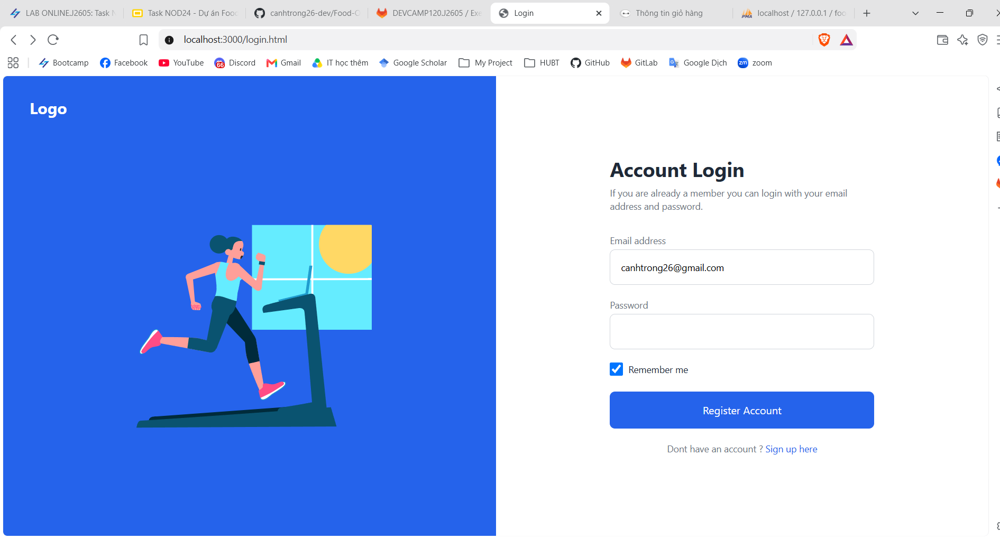
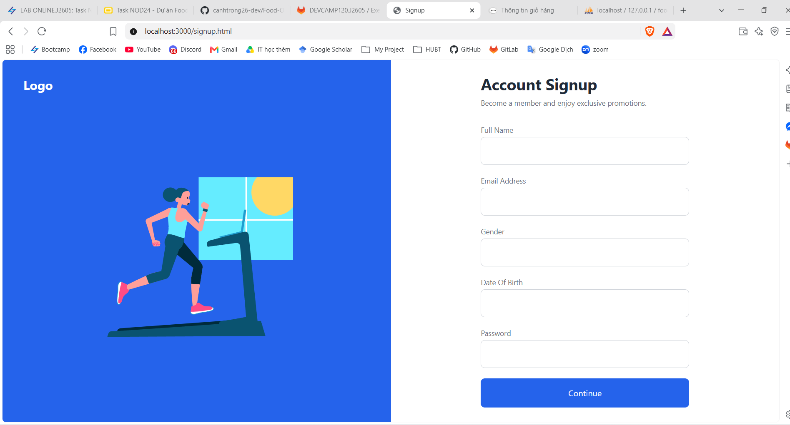
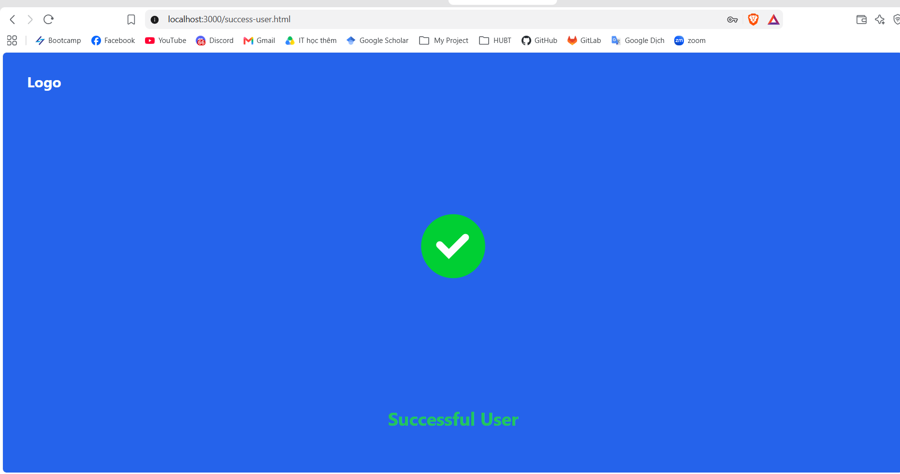

# Food Ordering Backend NodeJs CRUD Rest API v1.0

## 1. Mô tả dự án
Dự án xây dựng chức năng đăng nhập mua hàng sử dụng JWT Authentication + Authorization + Refresh Token.

---

## 2. Các chức năng

### Giao diện
| Login | Signup |
|-------|--------|
|  |  |

| Success Admin | Success User |
|---------------|--------------|
|  |  |

### API
| Method | Endpoint | Chức năng |
|--------|----------|-----------|
| POST | `/api/auth/login` | Đăng nhập |
| POST | `/api/auth/register` | Đăng ký |

---

## 3. Công nghệ sử dụng
| Backend | Frontend | Database |
|---------|----------|----------|
| NodeJS | Tailwind CSS | MySQL |
| ExpressJS | HTML | |
| Sequelize | | |
| JWT (jsonwebtoken) | | |
| Bcryptjs | | |